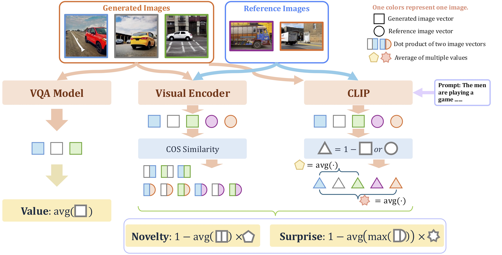

# Evaluation of Text-to-Image Generation from a Creativity Perspective

The official repo of paper [Evaluation of Text-to-Image Generation from a Creativity Perspective]().


## Authors

Xinhao Wang, Xinyu Ma, Shengyong Ding, Derek F. Wong.

## Abstract

In recent years, driven by advancements in the diffusion process, Text-to-Image (T2I) models have rapidly developed. However, evaluating T2I models remains a significant challenge. While previous research has thoroughly assessed the quality of generated images and image-text alignment, there has been little study on the creativity of these models. In this work, we defined the creativity of T2I models, inspired by previous definitions of machine creativity. We also proposed corresponding metrics and designed a method to test the reliability of the metric. Additionally, we developed a fully automated pipeline capable of transforming existing image-text datasets into benchmarks tailored for evaluating creativity, specifically through text vector retrieval and the text generation capabilities of large language models (LLMs). Finally, we conducted a series of tests and analyses on the evaluation methods for T2I model creativity and the factors influencing the creativity of the models, revealing that current T2I models demonstrate a lack of creativity.

## Content

[1. Data](#data)

[2. Requirements](#requirements)

[3. Running](#running)

[4. Thanks](#thanks)

[5. Citation](#citation)

[6. Contact](#contact)

## Data

We conducted experiments using the generated dataset.

```
benchmark/data.jsonl
```

You need to download the COCO_val2014 image files for evaluation.

## Requirements

Detailed dependencies are listed in environmnet.yml. Download Dinov2 large to ```models/models_visual/``` and LLaVA 1.5 7B to ```models/models_lvlm/```.

## Running

First, generate the images by T2I models. Put the images to the following path:

```
benchmark/image_generated/T2I_model_name/
benchmark/image_generated/T2I_model_name/0/*.png
benchmark/image_generated/T2I_model_name/1/*.png
...
benchmark/image_generated/T2I_model_name/383/*.png
```

And then, config ```eval/eval_creativity.bash```.

Finally, Run it.

## Citation

If our paper or code is helpful to you, please consider citing our work:

## Contact

If you have any questions, please email mc36507@um.edu.mo.
